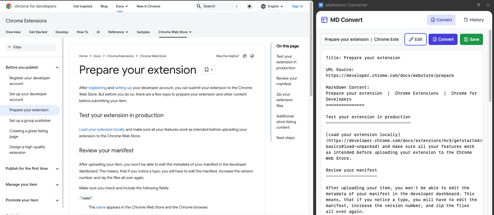
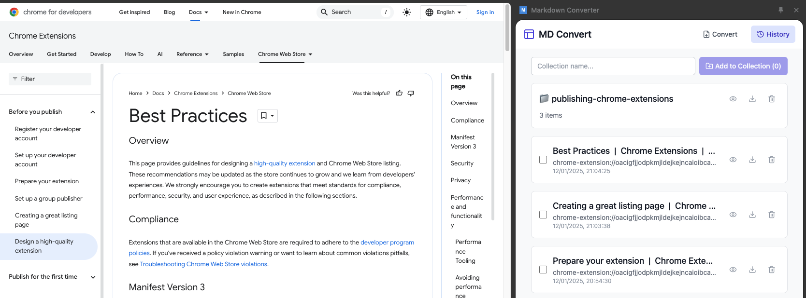

# doc-bot-chrome

A Chrome extension that converts web pages to Markdown format so they can be downloaded for consumption by LLM, with persistent local storage for converted content and the ability to compile converted pages into collections (single files ready for downloading).

#### Conversion:

#### Storage:


## Features

- Page Conversion: Convert any web page to markdown format using Jina Reader API
- Save/Edit: Save converted content and edit it later
- Preview Mode: Toggle between edit and preview modes
- History: View and manage previously converted pages
- Collections: Organize your converted content
  - Create collections of related conversions
  - Download collections as single markdown files
  - Persistent storage in Chrome
- Storage & Persistence:
  - Chrome storage integration for entries
  - Collection-based organization
  - Persistent unsaved conversions between tab switches
  - Download backups of entries
- Responsive UI: Adapts to different panel widths
  - Full text labels on wider screens (>400px)
  - Compact icon-only interface on narrow screens (≤400px)

## Requirements

### System Requirements
- Google Chrome (Version 88 or higher)
- macOS, Windows, or Linux operating system
- At least 100MB of free disk space
- Active internet connection for web page conversion

### Development Requirements
- Node.js (v18.0.0 or higher)
  ```bash
  node --version  # Check Node.js version
  ```
- npm (v9.0.0 or higher)
  ```bash
  npm --version  # Check npm version
  ```
- Git (v2.30.0 or higher)
  ```bash
  git --version  # Check Git version
  ```
- Chrome DevTools knowledge for debugging

## Project Structure

```
doc-bot-chrome/
├── manifest.json        # Chrome extension manifest
├── background.js       # Background service worker
├── vite.config.ts     # Vite build configuration
├── tailwind.config.js # Tailwind CSS configuration
├── front-end/         # React application
│   ├── src/          # Source code
│   │   ├── components/ # React components
│   │   │   ├── ConvertTab.tsx  # Page conversion UI
│   │   │   ├── HistoryTab.tsx  # History management
│   │   │   ├── Header.tsx     # Navigation header
│   │   │   ├── Toast.tsx     # Notification system
│   │   │   └── PreviewModal.tsx # Content preview
│   │   ├── types/    # TypeScript types
│   │   ├── App.tsx   # Main application
│   │   └── main.tsx  # Entry point
│   ├── icons/        # Extension icons
│   └── sidepanel.html # Side panel entry point
├── dist/             # Built extension
└── docs/            # Documentation
```

## Installation (Development)

1. Ensure all requirements are met (optional):
   ```bash
   node --version  # Should be ≥ 18.0.0
   npm --version   # Should be ≥ 9.0.0
   git --version   # Should be ≥ 2.30.0
   ```

2. Clone this repository:
   ```bash
   git clone https://github.com/Rajeev-SG/doc-bot-chrome.git
   ```

3. Navigate to project directory:
   ```bash
   cd doc-bot-chrome
   ```

4. Install dependencies:
   ```bash
   npm install
   ```

5. Build the extension:
   ```bash
   npm run build
   ```

6. Load in Chrome:
   - Open Chrome and go to `chrome://extensions/`
   - Enable "Developer mode" in the top right corner
   - Click "Load unpacked" in the top left corner
   - Select the `doc-bot-chrome` directory
   - The extension icon should appear in your Chrome toolbar

## Usage

1. Click the extension icon to open the side panel
2. Navigate to any webpage you want to convert
3. Click "Convert" to convert the current page to markdown
4. The converted content will be shown in preview mode
5. Click "Edit" to make changes to the content
6. Click "Save" to store the conversion
7. Use the History tab to:
   - View past conversions
   - Create collections
   - Download conversions or collections
   - Delete entries
8. Switch between tabs freely - unsaved conversions are preserved

## Permissions

The extension requires the following permissions:
- `tabs`: Access to browser tabs
- `storage`: Store converted content
- `scripting`: Execute content scripts
- `sidePanel`: Show the side panel interface
- Host permissions for:
  - `https://r.jina.ai/*`: Access Jina Reader API
  - `<all_urls>`: Access webpage content for conversion

## Known Issues and Future Plans

See [BUGS.md](BUGS.md) for known issues and planned improvements.

## Version History

See [CHANGELOG.md](CHANGELOG.md) for version history and updates.
